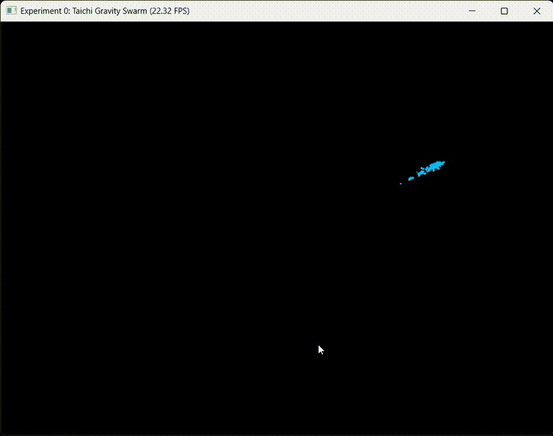

# CG-Lab 计算机图形学实验

基于 Taichi 框架的计算机图形学实验项目集合。

## 项目结构

```
CG-lab/
├── main.py              # 项目入口
├── pyproject.toml       # 项目配置文件
├── README.md            # 项目说明文档
├── assets/              # 资源文件夹（图片、模型等）
└── src/
    └── work0/           # 实验0：粒子群系统
        ├── __init__.py
        ├── config.py    # 物理系统和渲染参数配置
        ├── physics.py   # 物理计算内核（GPU 并行）
        └── main.py      # 实验0的主程序入口
```

## 实验列表

| 实验 | 描述 | 链接 |
|------|------|------|
| 实验 0 | 粒子群系统 | [详见下文](#实验0粒子群系统) |

---

## 实验 0：粒子群系统

### 概述

一个**交互式粒子群物理模拟系统**，通过 GPU 并行计算实现实时交互效果。用户可以通过鼠标与粒子群交互，体验流畅的物理模拟及渲染。

### 核心特性

-  **GPU 加速计算**：使用 Taichi 框架在 GPU 上进行并行物理计算
-  **鼠标交互**：粒子受鼠标位置吸引力影响
-  **物理模拟**：包含重力、空气阻力、边界碰撞等物理效果
-  **实时渲染**：流畅展示数千粒子的真实动画

### 技术栈

- **Python 3.12+**
- **Taichi >= 1.7.4** - GPU 计算框架
- **TaichiGUI** - 可视化渲染库

### 快速开始

1. **安装依赖**
   ```bash
   pip install -r pyproject.toml
   ```

2. **运行项目**
   ```bash
   python -m src.work0.main
   ```

3. **与粒子群交互**
   - 移动鼠标，粒子群会被吸引到鼠标位置
   - 关闭窗口退出程序

### 核心文件说明

| 文件 | 说明 |
|------|------|
| `config.py` | 定义粒子数量、引力强度、阻力系数等参数 |
| `physics.py` | 核心物理模拟逻辑，包括粒子初始化、引力计算、碰撞检测 |
| `main.py` | 主程序，驱动 GUI 渲染循环和物理更新循环 |

### 参数调优

在 `src/work0/config.py` 中可调整：
- `NUM_PARTICLES` - 粒子数量（若卡顿可调小，如改为 2000）
- `GRAVITY_STRENGTH` - 鼠标引力强度
- `DRAG_COEF` - 空气阻力系数
- `BOUNCE_COEF` - 边界碰撞反弹系数

## 效果展示


