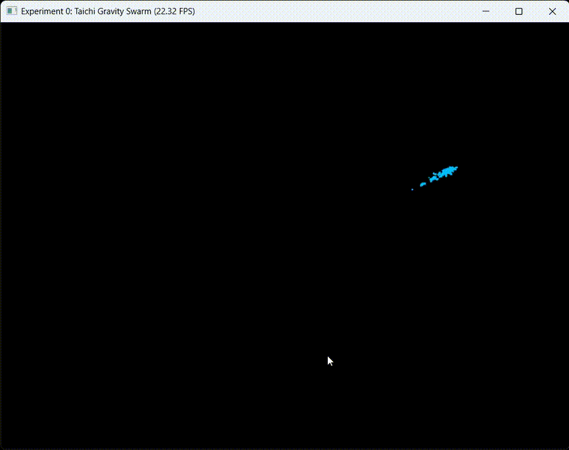
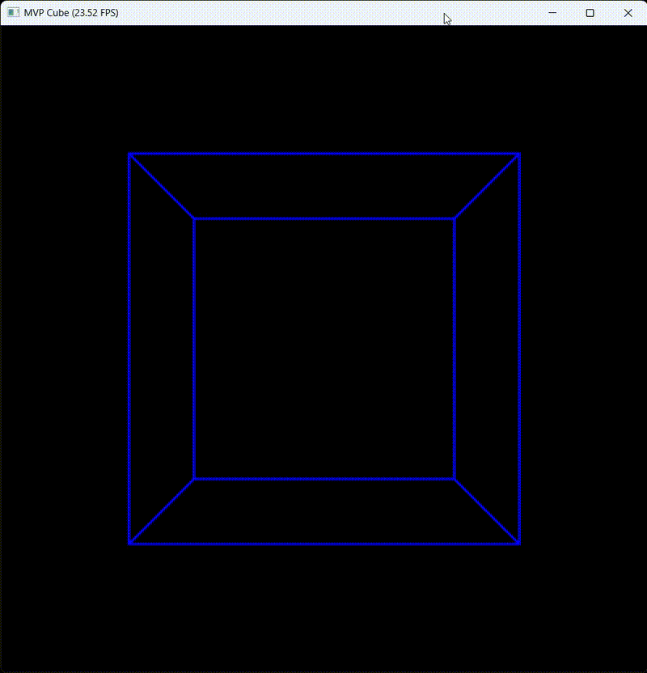

# CG-Lab 计算机图形学实验

基于 Taichi 框架的计算机图形学实验项目集合。

## 项目结构

```
CG-lab/
├── main.py              # 项目入口
├── pyproject.toml       # 项目配置文件
├── README.md            # 项目说明文档
├── assets/              # 资源文件夹（图片、模型等）
└── src/
    ├── work0/           # 实验0：粒子群系统
    │   ├── __init__.py
    │   ├── config.py    # 物理系统和渲染参数配置
    │   ├── physics.py   # 物理计算内核（GPU 并行）
    │   └── main.py      # 实验0的主程序入口
    └── work2/           # 实验2：MVP变换与3D立方体
        ├── __init__.py
        ├── config.py    # 3D对象定义与相机配置
        ├── physics.py   # 坐标变换与MVP矩阵计算
        └── main.py      # 实验2的主程序入口
```

## 实验列表

| 实验 | 描述 | 链接 |
|------|------|------|
| 实验 0 | 粒子群系统 | [目录](src/work0/) / [详情](#实验-0粒子群系统) |
| 实验 2 | MVP变换与3D立方体 | [目录](src/work2/) / [详情](#实验-2mvp变换与3d立方体) |

---

## 实验 0：粒子群系统 

### 概述

一个**交互式粒子群物理模拟系统**，通过 GPU 并行计算实现实时交互效果。用户可以通过鼠标与粒子群交互，体验流畅的物理模拟及渲染。

### 核心特性

-  **GPU 加速计算**：使用 Taichi 框架在 GPU 上进行并行物理计算
-  **鼠标交互**：粒子受鼠标位置吸引力影响
-  **物理模拟**：包含重力、空气阻力、边界碰撞等物理效果
-  **实时渲染**：流畅展示数千粒子的真实动画

### 技术栈

- **Python 3.12+**
- **Taichi >= 1.7.4** - GPU 计算框架
- **TaichiGUI** - 可视化渲染库

### 快速开始

1. **安装依赖**
   ```bash
   pip install -r pyproject.toml
   ```

2. **运行项目**
   ```bash
   python -m src.work0.main
   ```

3. **与粒子群交互**
   - 移动鼠标，粒子群会被吸引到鼠标位置
   - 关闭窗口退出程序

### 核心文件说明

| 文件 | 说明 |
|------|------|
| `config.py` | 定义粒子数量、引力强度、阻力系数等参数 |
| `physics.py` | 核心物理模拟逻辑，包括粒子初始化、引力计算、碰撞检测 |
| `main.py` | 主程序，驱动 GUI 渲染循环和物理更新循环 |

### 参数调优

在 `src/work0/config.py` 中可调整：
- `NUM_PARTICLES` - 粒子数量（若卡顿可调小，如改为 2000）
- `GRAVITY_STRENGTH` - 鼠标引力强度
- `DRAG_COEF` - 空气阻力系数
- `BOUNCE_COEF` - 边界碰撞反弹系数

## 效果展示




---

## 实验 2：MVP变换与3D立方体

### 概述

通过实现 **MVP（Model-View-Projection）变换**，将一个 3D 立方体从世界坐标系变换到屏幕坐标系进行渲染。展示计算机图形学中最核心的坐标变换流程。

### 核心特性

- **坐标变换管线**：实现完整的 Model → View → Projection → NDC → Screen 变换流程
- **3D对象渲染**：以线框形式渲染 3D 立方体
- **相机控制**：通过透视投影实现类似相机的视角
- **交互旋转**：通过键盘控制立方体绕Y轴旋转

### 技术实现

#### 1. 立方体几何定义

在 `config.py` 中定义中心在原点、边长为 2 的立方体：

```python
# 8个顶点（齐次坐标）
vertices = np.array([
    # 底面 (z = -1)
    [-1.0, -1.0, -1.0, 1.0],  # 顶点 0-3
    [1.0, -1.0, -1.0, 1.0],
    [1.0, 1.0, -1.0, 1.0],
    [-1.0, 1.0, -1.0, 1.0],
    # 顶面 (z = 1)
    [-1.0, -1.0, 1.0, 1.0],   # 顶点 4-7
    [1.0, -1.0, 1.0, 1.0],
    [1.0, 1.0, 1.0, 1.0],
    [-1.0, 1.0, 1.0, 1.0],
])

# 12条边的定义（顶点索引对）
edges = [
    (0, 1), (1, 2), (2, 3), (3, 0),  # 底面4条边
    (4, 5), (5, 6), (6, 7), (7, 4),  # 顶面4条边
    (0, 4), (1, 5), (2, 6), (3, 7),  # 竖直4条边
]
```

#### 2. MVP变换矩阵

在 `physics.py` 中实现三个核心的变换矩阵：

**模型变换（Model）**- 绕Z轴旋转：
```python
def get_model_matrix(angle):
    rad = np.deg2rad(angle)
    model = np.array([
        [np.cos(rad), -np.sin(rad), 0, 0],
        [np.sin(rad),  np.cos(rad), 0, 0],
        [0,            0,           1, 0],
        [0,            0,           0, 1],
    ])
    return model
```

**视图变换（View）** - 平移相机位置：
```python
def get_view_matrix(eye_pos):
    view = np.identity(4)
    view[0, 3] = -eye_pos[0]
    view[1, 3] = -eye_pos[1]
    view[2, 3] = -eye_pos[2]
    return view
```

**投影变换（Projection）** - 透视投影：
```python
def get_projection_matrix(eye_fov, aspect_ratio, z_near, z_far):
    # 1. 透视到正交变换
    persp_to_ortho = np.array([
        [z_near, 0,       0,               0],
        [0,      z_near,  0,               0],
        [0,      0,       z_near + z_far,  -z_near * z_far],
        [0,      0,       -1,              0]
    ])
    
    # 2. 正交投影变换
    ortho = np.array([
        [2/(right-left), 0, 0, -(right+left)/(right-left)],
        [0, 2/(top-bottom), 0, -(top+bottom)/(top-bottom)],
        [0, 0, 2/(z_near-z_far), -(z_near+z_far)/(z_near-z_far)],
        [0, 0, 0, 1]
    ])
    
    return ortho @ persp_to_ortho
```

#### 3. 坐标变换与齐次除法

将顶点从世界空间变换到屏幕空间：

```python
def transform(vertices, mvp):
    transformed = []
    for v in vertices:
        # MVP变换
        v = mvp @ v
        
        # 齐次除法（透视分割）
        v = v / v[3]
        
        # NDC坐标转屏幕坐标
        x = 0.5 * (v[0] + 1.0)
        y = 0.5 * (v[1] + 1.0)
        
        transformed.append([x, y])
    
    return np.array(transformed)
```

#### 4. 主程序与渲染

在 `main.py` 中进行实时渲染和交互：

```python
def main():
    gui = ti.GUI("MVP Cube", (config.width, config.height))
    angle = 0.0
    
    while gui.running:
        gui.clear(0x0)
        
        # 键盘交互：A/D 或左右键旋转
        for e in gui.get_events(ti.GUI.PRESS):
            if e.key in ['a', ti.GUI.LEFT]:
                angle += config.step
            elif e.key in ['d', ti.GUI.RIGHT]:
                angle -= config.step
        
        # 计算MVP矩阵
        model = physics.get_model_matrix(angle)
        view = physics.get_view_matrix(config.eye_pos)
        projection = physics.get_projection_matrix(...)
        mvp = projection @ view @ model
        
        # 坐标变换
        pts = physics.transform(config.vertices, mvp)
        
        # 绘制12条边
        for edge in config.edges:
            v1_idx, v2_idx = edge
            gui.line(pts[v1_idx], pts[v2_idx], radius=2, color=0x0000FF)
        
        gui.show()
```

### 运行程序

```bash
python -m src.work2.main
```

**交互方式**：
- 按 `A` 或 `←` 向左旋转立方体
- 按 `D` 或 `→` 向右旋转立方体
- 关闭窗口退出程序

## 效果展示



