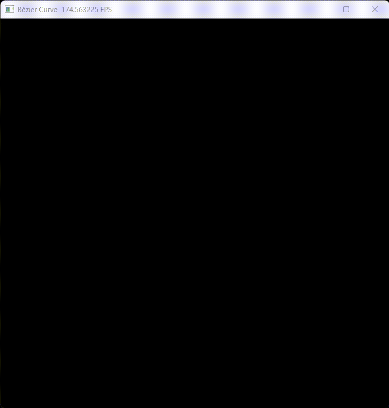
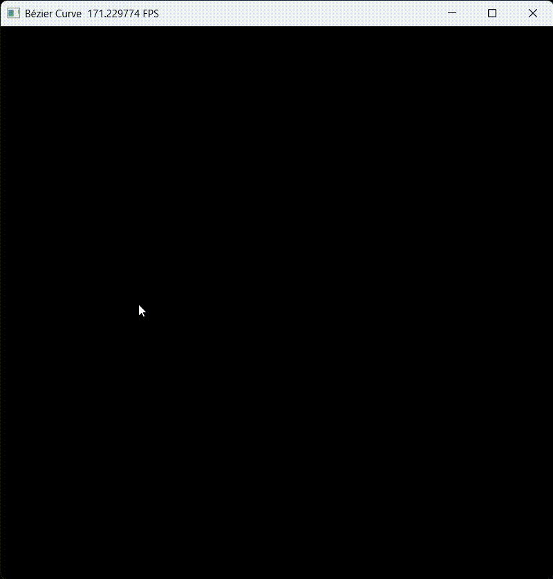

# CG-Lab 计算机图形学实验

基于 Taichi 框架的计算机图形学实验项目集合。

## 项目结构

```
CG-lab/
├── main.py              # 项目入口
├── pyproject.toml       # 项目配置文件
├── README.md            # 项目说明文档
├── assets/              # 资源文件夹（图片、模型等）
└── src/
    ├── work0/           # 实验0：粒子群系统
    │   ├── __init__.py
    │   ├── config.py    # 物理系统和渲染参数配置
    │   ├── physics.py   # 物理计算内核（GPU 并行）
    │   └── main.py      # 实验0的主程序入口
    └── work2/           # 实验2：MVP变换与3D立方体
        ├── __init__.py
        ├── config.py    # 3D对象定义与相机配置
        ├── physics.py   # 坐标变换与MVP矩阵计算
        └── main.py      # 实验2的主程序入口
```

## 实验列表

| 实验 | 描述 | 链接 |
|------|------|------|
| 实验 0 | 粒子群系统 | [目录](src/work0/) / [详情](#实验-0粒子群系统) |
| 实验 2 | MVP变换与3D立方体 | [目录](src/work2/) / [详情](#实验-2mvp变换与3d立方体) |
| 实验 3 | Bézier 曲线与光栅化 | [目录](src/work3/) / [详情](#实验-3bézier-曲线与光栅化) |

---

## 实验 0：粒子群系统 

### 概述

一个**交互式粒子群物理模拟系统**，通过 GPU 并行计算实现实时交互效果。用户可以通过鼠标与粒子群交互，体验流畅的物理模拟及渲染。

### 核心特性

-  **GPU 加速计算**：使用 Taichi 框架在 GPU 上进行并行物理计算
-  **鼠标交互**：粒子受鼠标位置吸引力影响
-  **物理模拟**：包含重力、空气阻力、边界碰撞等物理效果
-  **实时渲染**：流畅展示数千粒子的真实动画

### 技术栈

- **Python 3.12+**
- **Taichi >= 1.7.4** - GPU 计算框架
- **TaichiGUI** - 可视化渲染库

### 快速开始

1. **安装依赖**
   ```bash
   pip install -r pyproject.toml
   ```

2. **运行项目**
   ```bash
   python -m src.work0.main
   ```

3. **与粒子群交互**
   - 移动鼠标，粒子群会被吸引到鼠标位置
   - 关闭窗口退出程序

### 核心文件说明

| 文件 | 说明 |
|------|------|
| `config.py` | 定义粒子数量、引力强度、阻力系数等参数 |
| `physics.py` | 核心物理模拟逻辑，包括粒子初始化、引力计算、碰撞检测 |
| `main.py` | 主程序，驱动 GUI 渲染循环和物理更新循环 |

### 参数调优

在 `src/work0/config.py` 中可调整：
- `NUM_PARTICLES` - 粒子数量（若卡顿可调小，如改为 2000）
- `GRAVITY_STRENGTH` - 鼠标引力强度
- `DRAG_COEF` - 空气阻力系数
- `BOUNCE_COEF` - 边界碰撞反弹系数

## 效果展示


---

## 实验 2：MVP变换与3D立方体

### 概述

通过实现 **MVP（Model-View-Projection）变换**，将一个 3D 立方体从世界坐标系变换到屏幕坐标系进行渲染。展示计算机图形学中最核心的坐标变换流程。

### 核心特性

- **坐标变换管线**：实现完整的 Model → View → Projection → NDC → Screen 变换流程
- **3D对象渲染**：以线框形式渲染 3D 立方体
- **相机控制**：通过透视投影实现类似相机的视角
- **交互旋转**：通过键盘控制立方体绕Y轴旋转

### 技术实现

#### 1. 立方体几何定义

在 `config.py` 中定义中心在原点、边长为 2 的立方体：

```python
# 8个顶点（齐次坐标）
vertices = np.array([
    # 底面 (z = -1)
    [-1.0, -1.0, -1.0, 1.0],  # 顶点 0-3
    [1.0, -1.0, -1.0, 1.0],
    [1.0, 1.0, -1.0, 1.0],
    [-1.0, 1.0, -1.0, 1.0],
    # 顶面 (z = 1)
    [-1.0, -1.0, 1.0, 1.0],   # 顶点 4-7
    [1.0, -1.0, 1.0, 1.0],
    [1.0, 1.0, 1.0, 1.0],
    [-1.0, 1.0, 1.0, 1.0],
])

# 12条边的定义（顶点索引对）
edges = [
    (0, 1), (1, 2), (2, 3), (3, 0),  # 底面4条边
    (4, 5), (5, 6), (6, 7), (7, 4),  # 顶面4条边
    (0, 4), (1, 5), (2, 6), (3, 7),  # 竖直4条边
]
```

#### 2. MVP变换矩阵

在 `physics.py` 中实现三个核心的变换矩阵：

**模型变换（Model）**- 绕Z轴旋转：
```python
def get_model_matrix(angle):
    rad = np.deg2rad(angle)
    model = np.array([
        [np.cos(rad), -np.sin(rad), 0, 0],
        [np.sin(rad),  np.cos(rad), 0, 0],
        [0,            0,           1, 0],
        [0,            0,           0, 1],
    ])
    return model
```

**视图变换（View）** - 平移相机位置：
```python
def get_view_matrix(eye_pos):
    view = np.identity(4)
    view[0, 3] = -eye_pos[0]
    view[1, 3] = -eye_pos[1]
    view[2, 3] = -eye_pos[2]
    return view
```

**投影变换（Projection）** - 透视投影：
```python
def get_projection_matrix(eye_fov, aspect_ratio, z_near, z_far):
    # 1. 透视到正交变换
    persp_to_ortho = np.array([
        [z_near, 0,       0,               0],
        [0,      z_near,  0,               0],
        [0,      0,       z_near + z_far,  -z_near * z_far],
        [0,      0,       -1,              0]
    ])
    
    # 2. 正交投影变换
    ortho = np.array([
        [2/(right-left), 0, 0, -(right+left)/(right-left)],
        [0, 2/(top-bottom), 0, -(top+bottom)/(top-bottom)],
        [0, 0, 2/(z_near-z_far), -(z_near+z_far)/(z_near-z_far)],
        [0, 0, 0, 1]
    ])
    
    return ortho @ persp_to_ortho
```

#### 3. 坐标变换与齐次除法

将顶点从世界空间变换到屏幕空间：

```python
def transform(vertices, mvp):
    transformed = []
    for v in vertices:
        # MVP变换
        v = mvp @ v
        
        # 齐次除法（透视分割）
        v = v / v[3]
        
        # NDC坐标转屏幕坐标
        x = 0.5 * (v[0] + 1.0)
        y = 0.5 * (v[1] + 1.0)
        
        transformed.append([x, y])
    
    return np.array(transformed)
```

#### 4. 主程序与渲染

在 `main.py` 中进行实时渲染和交互：

```python
def main():
    gui = ti.GUI("MVP Cube", (config.width, config.height))
    angle = 0.0
    
    while gui.running:
        gui.clear(0x0)
        
        # 键盘交互：A/D 或左右键旋转
        for e in gui.get_events(ti.GUI.PRESS):
            if e.key in ['a', ti.GUI.LEFT]:
                angle += config.step
            elif e.key in ['d', ti.GUI.RIGHT]:
                angle -= config.step
        
        # 计算MVP矩阵
        model = physics.get_model_matrix(angle)
        view = physics.get_view_matrix(config.eye_pos)
        projection = physics.get_projection_matrix(...)
        mvp = projection @ view @ model
        
        # 坐标变换
        pts = physics.transform(config.vertices, mvp)
        
        # 绘制12条边
        for edge in config.edges:
            v1_idx, v2_idx = edge
            gui.line(pts[v1_idx], pts[v2_idx], radius=2, color=0x0000FF)
        
        gui.show()
```

### 运行程序

```bash
python -m src.work2.main
```

**交互方式**：
- 按 `A` 或 `←` 向左旋转立方体
- 按 `D` 或 `→` 向右旋转立方体
- 关闭窗口退出程序

## 效果展示


---

## 实验 3：Bézier 曲线与光栅化

### 概述

通过实现 **De Casteljau 算法** 计算 Bézier 曲线上的采样点，并结合 Taichi 的 GPU 字段与 kernel 将曲线光栅化到屏幕像素缓冲区中进行显示。展示计算机图形学中从**参数曲线生成**到**离散像素绘制**的基本流程。

### 核心特性

* **Bézier 曲线生成**：使用 De Casteljau 算法递归计算曲线上的点
* **GPU 光栅化**：将曲线采样点批量上传到 GPU 并并行写入像素缓冲区
* **交互控制点**：通过鼠标左键添加控制点，实时观察曲线形状变化
* **平滑显示对比**：实现普通像素映射与双线性插值两种绘制方式，比较显示效果差异

### 技术实现

#### 1. 曲线采样与显示参数

在 `config.py` 中定义窗口大小、曲线采样数、控制点数量上限以及颜色等参数：

```python
WINDOW_RES = (800, 800)    # 窗口分辨率
NUM_SEGMENTS = 1000         # 曲线采样数
MAX_CONTROL_POINTS = 100    # 最大控制点数量
CONTROL_POINT_COLOR = (1.0, 0.0, 0.0)  # 控制点颜色（红色）
CURVE_COLOR = (0.0, 1.0, 0.0)          # 曲线颜色（绿色）
CONTROL_POINT_RADIUS = 2 / WINDOW_RES[1]
```

其中，`NUM_SEGMENTS = 1000` 表示将参数区间 `[0,1]` 等分为 1000 段，因此每次会计算 `1001` 个曲线采样点，用于后续光栅化显示。

#### 2. De Casteljau 曲线计算

在 `main.py` 中实现 De Casteljau 算法，用于计算 Bézier 曲线在参数 `t` 处对应的点：

```python
def de_casteljau(points, t):
    """De Casteljau算法计算贝塞尔曲线上的点"""
    p = points[:]
    n = len(p)
    for r in range(1, n):
        for i in range(n - r):
            p[i] = (1 - t) * np.array(p[i]) + t * np.array(p[i + 1])
    return p[0]
```

其基本思想是：
对控制点序列不断进行相邻点之间的线性插值，每进行一轮，点的数量减少 1，直到最后只剩下 1 个点，这个点就是曲线在参数 `t` 处的位置。

主程序中会对 `t = i / NUM_SEGMENTS` 逐个采样，从而得到整条曲线上的离散点：

```python
curve_points_list = []
for i in range(NUM_SEGMENTS + 1):
    t = i / NUM_SEGMENTS
    point = de_casteljau(control_points, t)
    curve_points_list.append(point)
```

这样就完成了从控制点到 Bézier 曲线采样点的计算。

#### 3. GPU字段与像素缓冲区

在 `physics.py` 中预先定义了三个 Taichi 字段：

```python
pixels = ti.Vector.field(3, dtype=float, shape=WINDOW_RES)  # 最终画面
curve_points_field = ti.Vector.field(2, dtype=float, shape=NUM_SEGMENTS + 1)  # 曲线坐标
gui_points = ti.Vector.field(2, dtype=float, shape=MAX_CONTROL_POINTS)  # 控制点对象池
```

它们分别用于：

* `pixels`：保存最终显示的 RGB 像素
* `curve_points_field`：保存曲线采样点坐标
* `gui_points`：保存控制点位置，用于绘制控制点

这种预分配方式避免了在实时循环中频繁创建 GPU 数据结构，使程序运行更加稳定流畅。

#### 4. 普通插值与双线性插值

在将曲线点映射到屏幕像素时，可以采用两种不同方式。

**普通插值（最近像素点写入）**：
直接将浮点坐标映射到一个整数像素位置并点亮该像素。`physics.py` 中已经保留了这部分实现代码：

```python
# 直接写入像素（不做抗锯齿）
# x, y = curve_points_field[i]
# px = int(x * WINDOW_RES[0])
# py = int(y * WINDOW_RES[1])
# if 0 <= px < WINDOW_RES[0] and 0 <= py < WINDOW_RES[1]:
#     pixels[px, py] = [0.0, 1.0, 0.0]  # 绿色
```

这种方式实现简单，但因为一个曲线点只会落到一个像素上，所以显示时容易出现锯齿和离散感。

**双线性插值（平滑采样）**：
当前程序实际启用的是双线性插值方案。其做法是：先找到曲线点所在连续像素坐标周围的四个邻近像素，再根据点到四个像素的距离计算权重，并将亮度按权重分配给这四个像素：

```python
@ti.kernel
def draw_curve_kernel(n: ti.i32):
    """GPU绘制曲线内核：对单色曲线做双线性插值写入"""
    W = WINDOW_RES[0]
    H = WINDOW_RES[1]

    for i in range(n):
        x, y = curve_points_field[i]

        # 归一化坐标 -> 像素连续坐标
        fx = x * (W - 1)
        fy = y * (H - 1)

        x0 = int(fx)
        y0 = int(fy)
        x1 = x0 + 1
        y1 = y0 + 1

        dx = fx - x0
        dy = fy - y0

        # 双线性权重
        w00 = (1.0 - dx) * (1.0 - dy)
        w10 = dx * (1.0 - dy)
        w01 = (1.0 - dx) * dy
        w11 = dx * dy

        # 分配到四个邻近像素，只写绿色通道
        if 0 <= x0 < W and 0 <= y0 < H:
            pixels[x0, y0][1] = max(pixels[x0, y0][1], w00)

        if 0 <= x1 < W and 0 <= y0 < H:
            pixels[x1, y0][1] = max(pixels[x1, y0][1], w10)

        if 0 <= x0 < W and 0 <= y1 < H:
            pixels[x0, y1][1] = max(pixels[x0, y1][1], w01)

        if 0 <= x1 < W and 0 <= y1 < H:
            pixels[x1, y1][1] = max(pixels[x1, y1][1], w11)
```

相比普通插值，双线性插值能够让曲线在像素网格上的亮度过渡更加平滑，因此视觉效果更自然。

需要说明的是，这里的“普通插值”和“双线性插值”比较的是**曲线点映射到像素时的采样方式**，而不是 Bézier 曲线本身的求点算法。Bézier 曲线点仍然是通过 De Casteljau 算法计算得到的。

#### 5. 主程序与交互绘制

在 `main.py` 中，主循环负责处理用户输入、计算曲线并完成渲染：

```python
def run():
    window = ti.ui.Window("Bézier Curve", WINDOW_RES)
    canvas = window.get_canvas()

    control_points = []

    while window.running:
        # 清空pixels
        clear_pixels()

        # 处理事件
        for e in window.get_events(ti.ui.PRESS):
            if e.key == ti.ui.LMB:
                if len(control_points) < MAX_CONTROL_POINTS:
                    pos = window.get_cursor_pos()
                    control_points.append(pos)
            elif e.key == 'c':
                control_points = []

        # 计算并绘制曲线
        if len(control_points) >= 2:
            curve_points_list = []
            for i in range(NUM_SEGMENTS + 1):
                t = i / NUM_SEGMENTS
                point = de_casteljau(control_points, t)
                curve_points_list.append(point)
            curve_points_field.from_numpy(np.array(curve_points_list))
            draw_curve_kernel(NUM_SEGMENTS + 1)

        # 绘制控制点
        gui_points_np = np.full((MAX_CONTROL_POINTS, 2), -10.0)
        for i, p in enumerate(control_points):
            gui_points_np[i] = p
        gui_points.from_numpy(gui_points_np)

        canvas.set_image(pixels)
        canvas.circles(gui_points, radius=CONTROL_POINT_RADIUS, color=CONTROL_POINT_COLOR)

        window.show()
```

这里的流程可以概括为：

1. 清空上一帧像素缓冲区
2. 响应鼠标和键盘输入
3. 若控制点数量不少于 2，则重新计算曲线采样点
4. 将采样点上传到 GPU 字段并调用 kernel 绘制
5. 将控制点绘制为红色圆点
6. 显示当前帧画面

其中，控制点绘制采用“对象池”思想：固定分配长度为 `MAX_CONTROL_POINTS` 的字段，多余位置填充屏幕外坐标，从而适配 `canvas.circles()` 的固定长度输入需求。

### 运行程序

```bash
python -m src.work3.main
```

**交互方式**：

* 鼠标左键点击：添加控制点
* 按 `c`：清空控制点和曲线
* 关闭窗口退出程序

### 普通插值 vs 双线性插值

* **普通插值**：将曲线采样点直接映射到单个像素上，只点亮最近的像素点，实现简单，但边缘容易出现锯齿和断裂。
* **双线性插值**：将曲线点对周围四个邻近像素按权重分配亮度，使像素过渡更平滑，减轻锯齿感，显示效果更好。

## 效果展示

普通插值（最近像素点）：



双线性插值（像素级平滑采样）：




